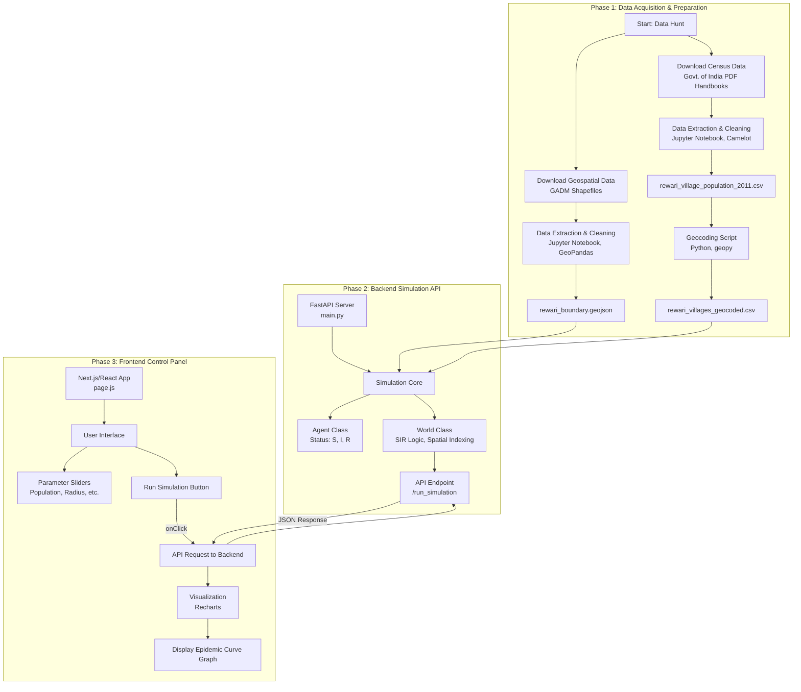

# Aetheria-H: An Agent-Based Epidemic Simulator

**Aetheria-H** is a full-stack web application designed to simulate the spread of infectious diseases through a hyper-local, agent-based model. Calibrated using real-world census data for the Rewari district in Haryana, India, this platform serves as a powerful tool for public health research, policy testing, and understanding the complex dynamics of a pandemic.

The project's primary goal is to create a "digital twin" of a real-world population and use it as a sandbox to run experiments that would be impossible in real life. It moves beyond traditional equation-based models by simulating the interactions of hundreds of thousands of individual agents, each with their own state and location, allowing for the emergence of complex, system-wide behavior.

---

## Project Flowchart

This flowchart illustrates the entire data and application pipeline, from raw data acquisition to the final interactive visualization.



---

## Key Features

- **Data-Driven World Generation:** The simulation environment is built from the ground up using official 2011 Census data for population figures and GADM data for geographical boundaries, ensuring a realistic population distribution.
- **Agent-Based Modeling (ABM):** Simulates a population of over 600,000 individual agents, each with a health status (Susceptible, Infected, or Recovered) based on the classic SIR epidemiological model.
- **Spatial Transmission:** The spread of disease is not random; it's based on the geographic proximity of agents, calculated efficiently using a k-d tree spatial index.
- **Interactive Control Panel:** A web-based frontend built with Next.js and React allows users to control simulation parameters like population size, infection radius, and transmission probability.
- **Dynamic Visualization:** The results of the simulation, including the classic S-I-R epidemic curve, are plotted in real-time using Recharts.
- **Full-Stack Architecture:** A robust backend built with Python and FastAPI serves the simulation results to a modern, responsive frontend.

---

## Visualizations & Results

### 1. The Great Settlement: Population Distribution

This plot shows the initial state of the simulation world. Each of the ~667,000 dots represents one agent, placed in a cluster around their geocoded home village. This creates a realistic digital twin of Rewari district's population density.

**`[INSERT YOUR POPULATION DISTRIBUTION PLOT HERE - image_ff46f8.png]`**


### 2. The First Wave: Baseline Epidemic Curve

This graph shows the output of a baseline simulation with no interventions. It clearly demonstrates the classic S-I-R curve, validating the core logic of the model.

**`[INSERT YOUR BASELINE SIR CURVE HERE - image_ffd4e9.jpg]`**


### 3. Experiment 1: Flattening the Curve

This is the first major result of the project. It compares the baseline simulation (in red) to a scenario where a "social distancing" policy (reducing the infection radius) is implemented on Day 30. The result is a clear and dramatic "flattening of the curve," demonstrating the model's utility for policy testing.

**`[INSERT YOUR INTERVENTION COMPARISON PLOT HERE]`**


---

## Tech Stack

- **Backend:** Python, FastAPI, Camelot-py (for data extraction), GeoPandas, NumPy, SciPy.
- **Frontend:** JavaScript, Next.js, React, Tailwind CSS, Recharts.
- **Data Processing:** Jupyter Notebooks, Pandas.
- **DevOps:** Virtual Environments (`venv`), `npm`.

---

## Project Structure

```
Aetheria-H/
├── backend/
│   ├── venv/                 # Python Virtual Environment
│   ├── main.py               # FastAPI application
│   ├── 01_data_extraction.ipynb # Notebook for PDF data extraction
│   └── 02_simulation_skeleton.ipynb # Notebook for building and testing the model
├── frontend/
│   ├── src/
│   │   └── app/
│   │       └── page.js       # Main React component for the UI
│   ├── package.json
│   └── ...
├── data/
│   ├── demographics/         # Raw census PDFs
│   ├── geospatial/           # Raw shapefiles
│   ├── rewari_boundary.geojson
│   └── rewari_village_population_2011.csv
└── README.md                 # This file
```

---

## Setup and Installation

Follow these steps to set up and run the project on your local machine.

### Prerequisites

- Python 3.9+
- Node.js 18+
- Git

### 1. Clone the Repository

```bash
git clone <your-repo-url>
cd Aetheria-H
```

### 2. Backend Setup

```bash
# Navigate to the backend directory
cd backend

# Create and activate a Python virtual environment
python3 -m venv venv
source venv/bin/activate
# On Windows, use: venv\Scripts\activate

# Install the required Python libraries
pip install -r requirements.txt
```

_(Note: You will need to create a `requirements.txt` file using `pip freeze > requirements.txt`)_

### 3. Frontend Setup

```bash
# Navigate to the frontend directory in a new terminal
cd frontend

# Install the required Node.js packages
npm install
```

---

## How to Run the Application

You must have both the backend and frontend servers running simultaneously.

### 1. Run the Backend API

```bash
# In your backend terminal (with venv activated)
cd backend
uvicorn main:app --reload
```

The API server will start on `http://127.0.0.1:8000`.

### 2. Run the Frontend Application

```bash
# In your frontend terminal
cd frontend
npm run dev
```

The web application will be available at `http://localhost:3000`. Open this URL in your browser to use the control panel.

---

## Future Work & Roadmap

This project serves as a strong foundation. Future research and development could include:

- **Implementing the Dual-Contagion Model:** Add a second layer to the simulation to model the spread of information and misinformation, and its effect on agent behavior.
- **Adding More Interventions:** Model vaccination campaigns, mask mandates, and targeted lockdowns based on real-time infection clusters.
- **Network-Based Social Graphs:** Replace purely spatial interaction with a more realistic social network graph (e.g., connecting agents in households and workplaces) for higher fidelity simulations.
- **Model Validation:** Calibrate the model's parameters and validate its output against real-world historical case data from Rewari district to improve its predictive accuracy.
